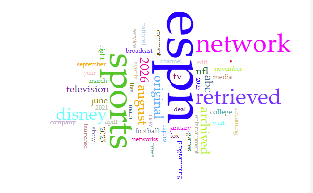
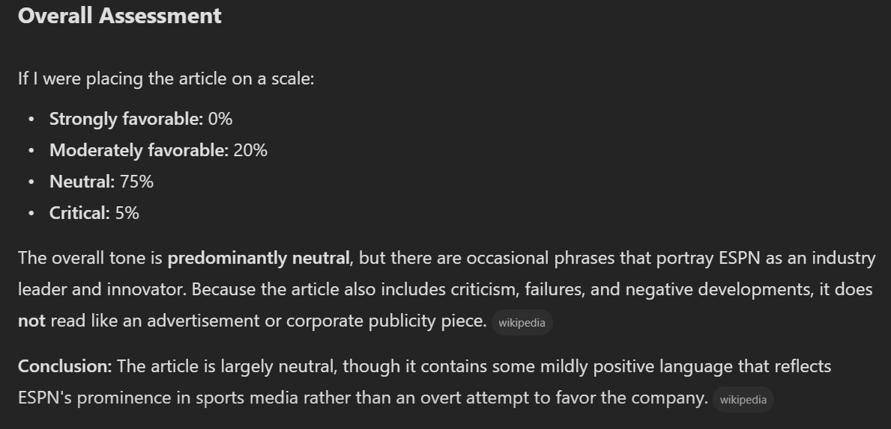
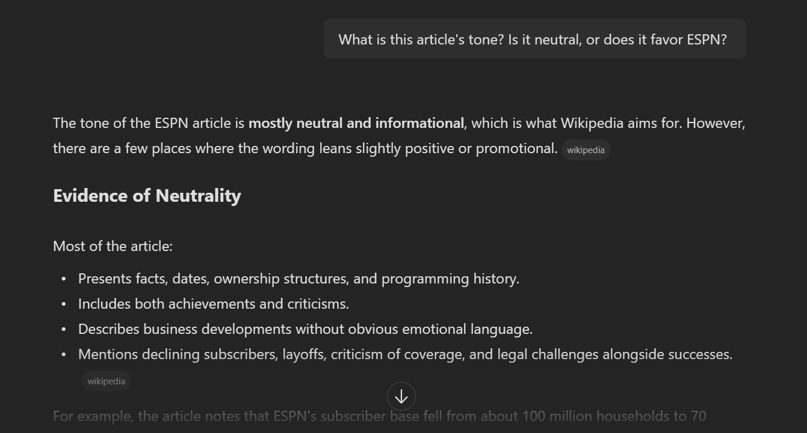



# Distant Reading Assignment 

I used voyance to search this website [ESPN WIKI](https://en.wikipedia.org/wiki/ESPN)

I used Voyant and Copilot to analyze the Wikipedia article on ESPN. Voyant showed that words like ESPN, sports, & network came up the most, and it counted Disney 72 times, which tells me the article is more about ESPN as a business than about the sports it covers. But Voyant can only count words, so it couldn't tell me anything about tone or bias. Copilot was better at that part, saying the article is mostly neutral but uses a few positive phrases like calling ESPN the "Worldwide Leader in Sports," though it also rated the tone with made-up percentages that looked exact but weren't really measurable. Copilot was also inconsistent with numbersin one chat it admitted it could only guess the most frequent words, but in another it said Disney showed up exactly 8 times, even though Voyant found 72. This taught me that distant reading tools are great for spotting patterns, but you still need to double-check them and use your own reading to understand what the numbers actually mean.

Check out my image!

---
Here are parts of my convos with Copilot!
---

